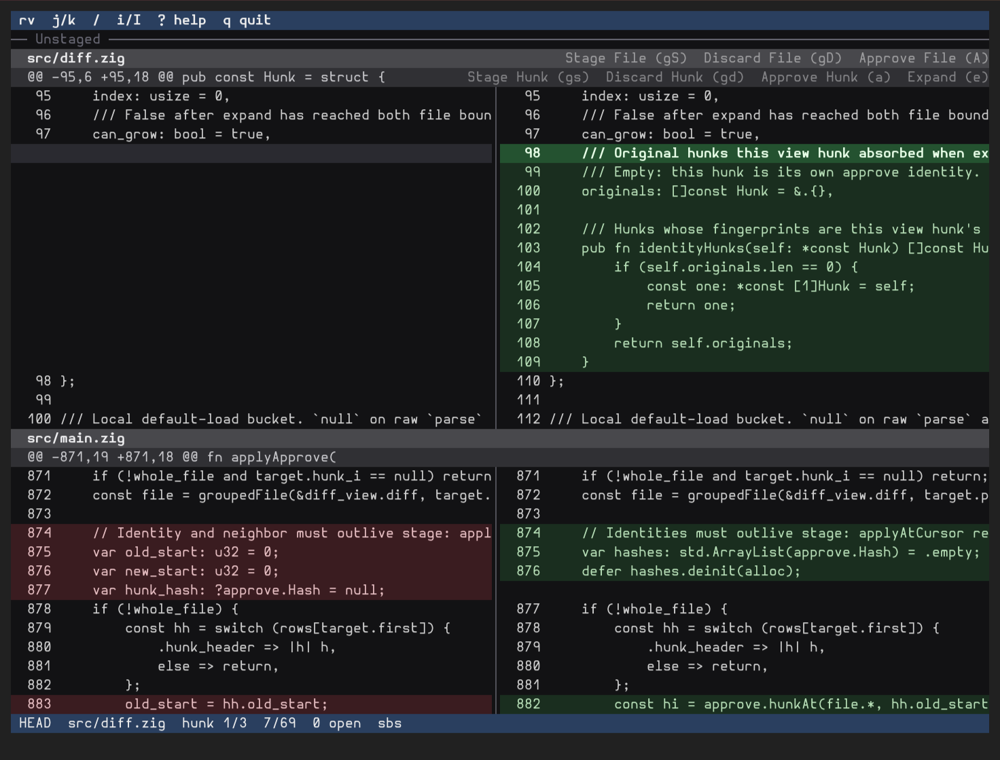
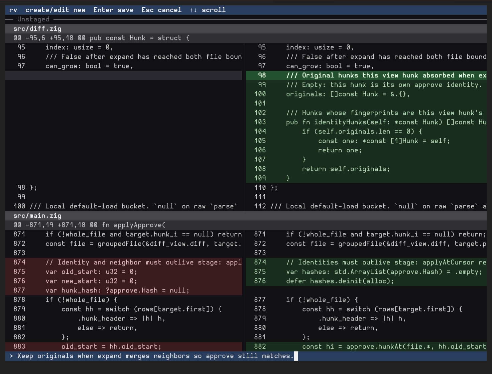

# rv

**Local terminal diff review for humans.**

Review and approve hunks or files. Add comments. Tell your agent `rv comments` and it will address them.

## Install

Linux and macOS. No Windows builds yet.

```sh
curl -fsSL https://raw.githubusercontent.com/Zooce/rv/master/install.sh | sh
```

Puts `rv` in `~/.local/bin`. If that directory is not on `PATH`:

```sh
export PATH="$HOME/.local/bin:$PATH"
```

Then:

```sh
rv install-skill
```

### From source

Zig 0.16.0.

```sh
zig build -Doptimize=ReleaseSafe --prefix ~/.local
rv install-skill
```






## Use

```sh
rv                 # local changes (staged, unstaged, untracked)
rv HEAD            # one commit
rv main...HEAD     # a range
```

Vim keys move a **current line** on the diff. `i` / `Enter` comments there. `a` / `A` approve a hunk or file (stages, then hides). Press `?` for keybindings.

```sh
rv export          # comments for the agent
rv list
rv resolve <id>    # drop an addressed comment
rv approved        # hidden hunks and files
rv unapprove <n>
```

`rv` does not apply fixes. It is the comment board; the agent does the work.

## License

MIT. See [LICENSE](LICENSE).
