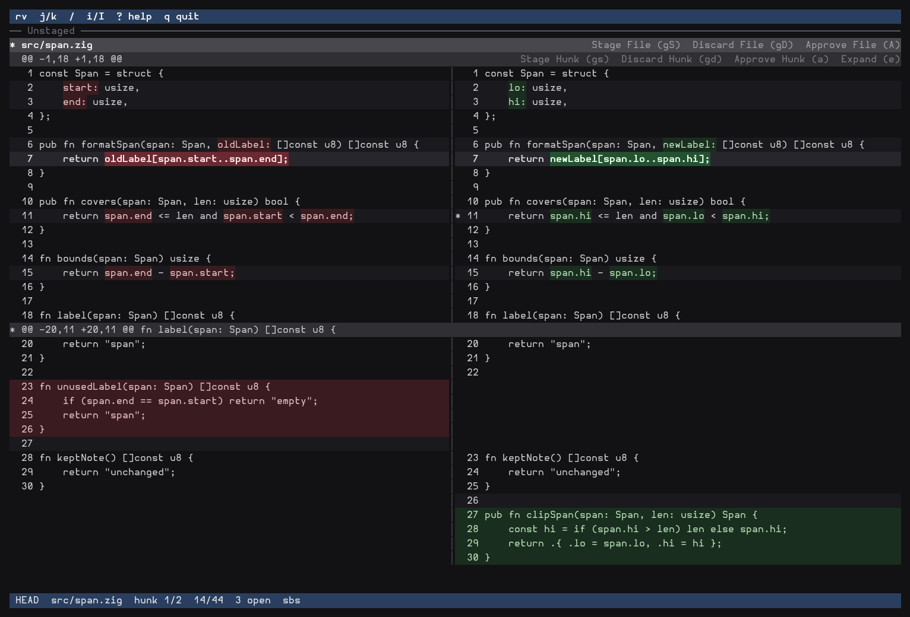
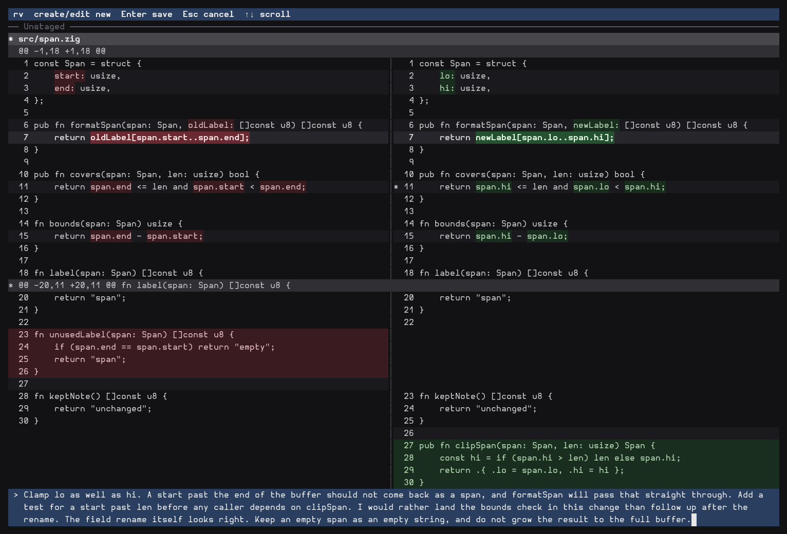
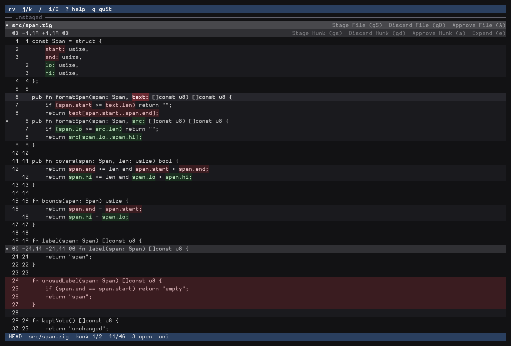
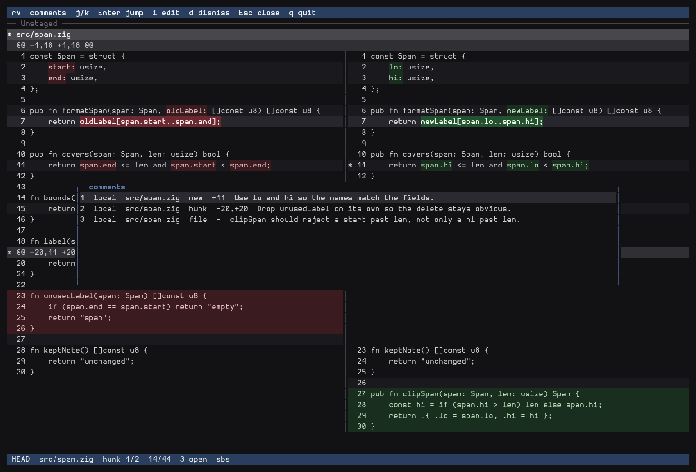
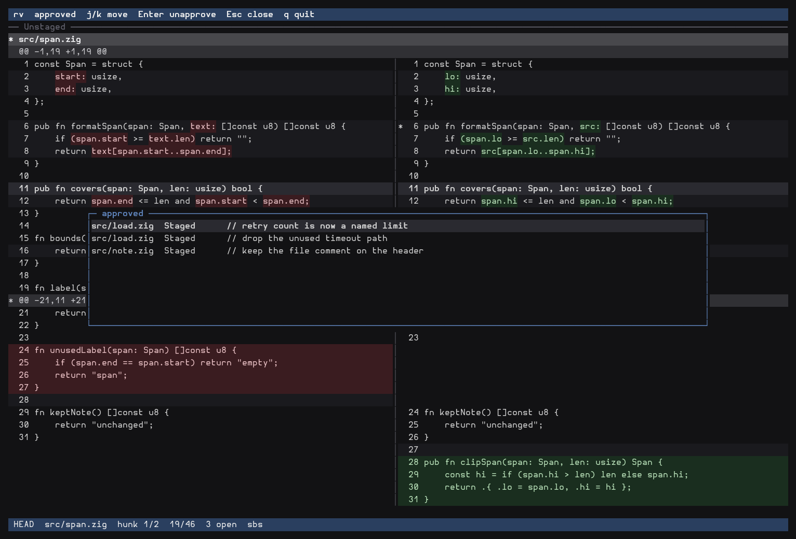

# rv

**Local terminal diff review for humans.**

Open `rv` on your local changes. Approve the changes you like, and comment on the changes you have feedback on. Tell your agent to address your rv comments. Reload with `r` and continue until you are happy with the changes.

## Install

Linux and macOS. No Windows builds yet.

```sh
curl -fsSL https://raw.githubusercontent.com/Zooce/rv/master/install.sh | sh
```

Puts `rv` in `~/.local/bin`. If that directory is not on `PATH`:

```sh
export PATH="$HOME/.local/bin:$PATH"
```

Then:

```sh
npx skills add Zooce/rv -g
```

### From source

Zig 0.16.0.

```sh
zig build -Doptimize=ReleaseSafe --prefix ~/.local
npx skills add Zooce/rv -g
```

## Screenshots

### Side-by-side diff

Changed words are colored on the line. Unchanged words on that line stay grey. A whole line that was added or deleted stays green or red.



### Writing a comment

`i` opens the comment box under the diff. The box grows as the comment wraps.



### Unified diff

`t` shows the same review as a unified diff.



### Comment list

`Space` then `c` lists open comments.



### Approved list

`Space` then `a` lists approved hunks. Approving stages a hunk and hides it from the diff.



## Use

```sh
rv                 # local changes (staged, unstaged, untracked)
```

`j` and `k` move the current line. The scroll wheel moves the window and leaves that line selected. Shift+wheel, or a sideways trackpad scroll, pans the hunk under the pointer. `a` approves the hunk at that line and `A` approves the whole file. Approving stages the change and hides it from the diff. `i` or `Enter` comments on the current line. Press `?` for every key, and `q` to quit.

Tell your agent to address your rv comments. The skill from the install step reads those comments, edits the code, and resolves each comment it has handled. What you approved stays staged and stays out of the next diff.

`r` reloads the diff and the comments. Continue until you are happy with the changes.

```sh
rv HEAD            # one commit
rv main...HEAD     # a range
```

```sh
rv list            # open comments
rv export          # those comments as markdown
rv resolve <id>    # drop an addressed comment
rv approved        # hidden hunks and files
rv unapprove <n>
```

`rv` keeps your approvals and your comments. Your agent changes the code.

## License

MIT. See [LICENSE](LICENSE).
